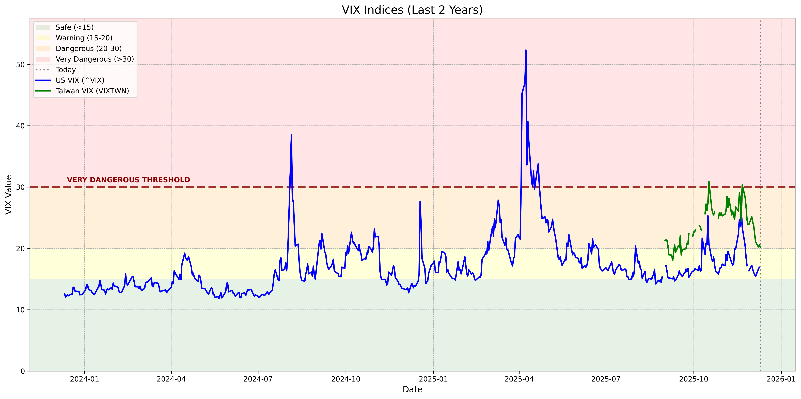

# Global VIX Data Collector


This project collects and merges VIX (Volatility Index) data for the **US**, **Japan**, and **Taiwan** markets.

## 🤖 Automatic Daily Updates

This repository automatically updates VIX data **every day at 2 PM UTC** (10 PM Taiwan time) using GitHub Actions. The automation:
- ✅ Collects latest US VIX data
- ✅ Downloads new Taiwan VIX data from TAIFEX
- ✅ Regenerates the visualization chart
- ✅ Updates current VIX values in README
- ✅ Commits changes back to the repository

You can also manually trigger the update from the [Actions tab](../../actions/workflows/update-vix-data.yml).

## Prerequisites

1.  **Python 3.x**
2.  Install required libraries:
    ```bash
    pip install -r requirements.txt
    ```

## Usage

Run the collection script:

```bash
python collect_vix_data.py
```

## Current VIX Data

*   **US VIX (^VIX)**: **17.42**
*   **Japan VIX (Nikkei VI)**: Current data is not automatically retrievable. Please refer to financial news sources or the Nikkei website.
*   **Taiwan VIX (VIXTWN)**: Current data is not automatically retrievable. Please refer to financial news sources or the TAIFEX website.

### Historical Trend (Last 2 Years)

產生時間: 2025-12-10 22:53:11 CST



## Data Sources & Instructions

The script automatically fetches **US VIX** and **Taiwan VIX** data (recent months). Japan VIX requires manual download due to website limitations.

### 1. US VIX (`^VIX`)
*   **Status**: **Automatic**. Fetched via `yfinance`.

### 2. Japan VIX (Nikkei Stock Average Volatility Index)
*   **Status**: **Manual Download Required**.
*   **Steps**:
    1.  Go to the [Nikkei Indexes Download Center](https://indexes.nikkei.co.jp/nkave/archives/data/nk225vi_daily_jp.csv).
    2.  Download the **Daily Data (CSV)** file.
    3.  **Rename** the file to: `nk225vi_daily_jp.csv`.
    4.  Place it in this project folder.

### 3. Taiwan VIX (TAIEX Options Volatility Index)
*   **Status**: **Fully Automatic** (for recent months).
*   **Automatic Download**: The script automatically downloads Taiwan VIX data from TAIFEX's official data files. TAIFEX provides recent months of data (typically last 3-4 months) as downloadable TXT files.
*   **Data Availability**: Automatic download works for recent months. Historical data beyond what TAIFEX provides online requires manual download.
*   **Manual Download** (for older historical data):
    1.  Go to the [TAIFEX VIX Daily Data Page](https://www.taifex.com.tw/enl/eng7/vixDaily3MNew).
    2.  Click the "Download" button for the desired month.
    3.  Save and **rename** the file to: `taifex_vix.csv`.
    4.  Place it in this project folder.
*   **Note**: The script automatically attempts to download all months from your specified start date. Only recent months are available online from TAIFEX.

## Output
The script generates `global_vix_merged.csv` containing the combined data (aligned by date).
