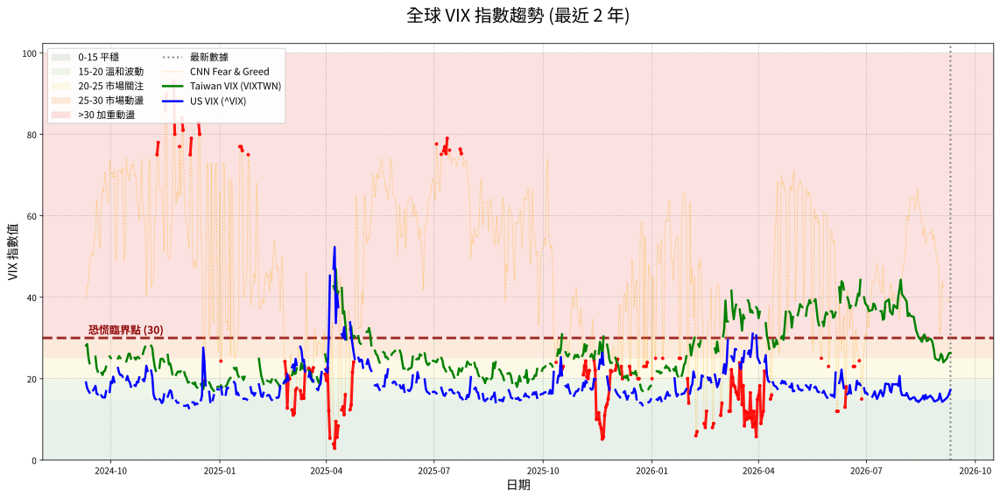

# Global VIX Data Collector


📊 **[點此查看：台指 VIX 互動式趨勢圖](https://wenchiehlee-money.github.io/VIX/)**

This project collects and merges VIX (Volatility Index) data for the **US**, **Japan**, and **Taiwan** markets.

## 🤖 Automatic Daily Updates

This repository automatically updates VIX data **every day at 2 PM UTC** (10 PM Taiwan time) using GitHub Actions. The automation:
- ✅ Collects latest US VIX data
- ✅ Downloads new Taiwan VIX data from TAIFEX
- ✅ Regenerates the visualization chart
- ✅ Updates current VIX values in README
- ✅ Commits changes back to the repository

You can also manually trigger the update from the [Actions tab](../../actions/workflows/update-vix-data.yml).

## Prerequisites

1.  **Python 3.x**
2.  Install required libraries:
    ```bash
    pip install -r requirements.txt
    ```

## Usage

Run the collection script:

```bash
python collect_vix_data.py
```

Generate visualizations:

```bash
# Static SVG for README
python visualize_vix.py

# Interactive HTML for detailed analysis
python visualize_vix_interactive.py
```

## 市場情緒與波動率概覽 (Current Status)

| 指標 | 當前數值 | 市場情緒 / 評級 | 最後更新 |
| :--- | :---: | :---: | :---: |
| **美股波動率 (US VIX)** | <!-- US_VIX_VAL -->**15.78**<!-- /US_VIX_VAL --> | <!-- US_VIX_SENT -->溫和波動<!-- /US_VIX_SENT --> | 實時 (yfinance) |
| **台指波動率 (Taiwan VIX)** | <!-- TW_VIX_VAL -->**35.87**<!-- /TW_VIX_VAL --> | <!-- TW_VIX_SENT -->加重動盪<!-- /TW_VIX_SENT --> | <!-- TW_VIX_DATE -->2026-05-29<!-- /TW_VIX_DATE --> |
| **CNN 恐懼與貪婪指數** | <!-- CNN_FG_VAL -->**60.31**<!-- /CNN_FG_VAL --> | <!-- CNN_FG_SENT -->Greed<!-- /CNN_FG_SENT --> | <!-- CNN_FG_DATE -->2026-05-29<!-- /CNN_FG_DATE --> |

### Historical Trend

- **US VIX**：<!-- US_VIX_COUNT -->N/A<!-- /US_VIX_COUNT --> 筆，<!-- US_VIX_RANGE -->N/A<!-- /US_VIX_RANGE -->
- **Taiwan VIX**：<!-- TW_VIX_COUNT -->N/A<!-- /TW_VIX_COUNT --> 筆，<!-- TW_VIX_RANGE -->N/A<!-- /TW_VIX_RANGE -->
- **CNN Fear & Greed**：<!-- CNN_FG_COUNT -->N/A<!-- /CNN_FG_COUNT --> 筆，<!-- CNN_FG_RANGE -->N/A<!-- /CNN_FG_RANGE -->
產生時間: 2026-05-28 00:58:39 CST




## Data Sources & Instructions

The script automatically fetches **US VIX** and **Taiwan VIX** data (recent months). Japan VIX requires manual download due to website limitations.

### 1. US VIX (`^VIX`)
*   **Status**: **Automatic**. Fetched via `yfinance`.

### 2. Japan VIX (Nikkei Stock Average Volatility Index)
*   **Status**: **Manual Download Required**.
*   **Steps**:
    1.  Go to the [Nikkei Indexes Download Center](https://indexes.nikkei.co.jp/nkave/archives/data/nk225vi_daily_jp.csv).
    2.  Download the **Daily Data (CSV)** file.
    3.  **Rename** the file to: `nk225vi_daily_jp.csv`.
    4.  Place it in this project folder.

### 3. Taiwan VIX (TAIEX Options Volatility Index)
*   **Status**: **Fully Automatic**.
*   **Automatic Download**: The script automatically downloads Taiwan VIX data from TAIFEX's official data files.
*   **Data Availability**: TAIFEX provides recent months online (typically last 3-4 months). The script downloads all available months automatically.
*   **Historical Data Accumulation**: With daily GitHub Actions automation, historical data accumulates over time. After running for several months, you'll have a complete historical dataset without any manual intervention.
*   **Manual Download** (optional, only if you need older historical data immediately):
    1.  Download monthly TXT files from TAIFEX: `https://www.taifex.com.tw/file/taifex/Dailydownload/vix/log2data_eng/YYYYMMnew.txt` (replace YYYYMM with year and month, e.g., 202401new.txt for January 2024)
    2.  Combine multiple months into a CSV file with columns: Date, Close (VIX value)
    3.  Save as `taifex_vix.csv` in this project folder
    4.  The script will merge this with automatically downloaded data

### 4. CNN Fear & Greed Index
*   **Status**: **Automatic**.
*   **Details**: Fetched via CNN's internal API. Provides market sentiment analysis on a scale of 0-100.
*   **Data Storage**: Saved in `cnn_fear_greed.csv`.
*   **Rating Categories**:
    - 0-25: Extreme Fear
    - 26-44: Fear
    - 45-55: Neutral
    - 56-74: Greed
    - 75-100: Extreme Greed

## Output
The script generates `global_vix_merged.csv` containing the combined data (aligned by date).
